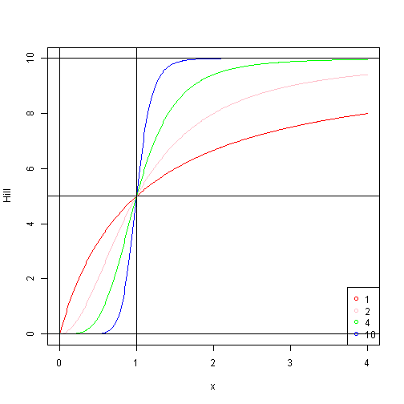

---

title       : Hill Function
subtitle    : Data Product Project
author      : JediZ
job         : Coursera
framework   : io2012        # {io2012, html5slides, shower, dzslides, ...}
highlighter : highlight.js  # {highlight.js, prettify, highlight}
hitheme     : tomorrow      # 
widgets     : []            # {mathjax, quiz, bootstrap}
mode        : selfcontained # {standalone, draft}

---

## Introduction

1. Enzyme Kinetics
    * Michaelis-Menten equation  
    
2. Cooperativity  
    In biochemistry, the binding of a ligand to a macromolecule is often enhanced if there are already other ligands present on the same macromolecule (this is known as cooperative binding). The Hill coefficient provides a way to quantify this effect.  
    * potassium channel  
    * hemoglobin  
    
3. Hill Coefficient  
    
    Hill coefficient, describing cooperativity (or possibly other biochemical properties, depending on the context in which the Hill equation is being used)


--- .class #id 

## Hill Function
### Definition:


  

where S is substrate concentration,  
h is hill number,  
Km and Vm has same meaning as in Michaelis-Menten Equation.  

### R code:

```r
hill <- function(x, Km, Vm, h=1) {
    xh <- x^h
    Kmh <- Km^h
    Vm*xh / (Kmh+xh)
}
```

---

## Hill Function in Action
```
h = 1,2,4,10;  
Km = 1; Vm = 10;  
```
 

---

## Resources and References

* [Enzyme Kinetics](http://en.wikipedia.org/wiki/Enzyme_kinetics)  
* [Michaelis-Menten Equation](http://en.wikipedia.org/wiki/Michaelis%E2%80%93Menten_kinetics)  
* [Hill Equation](http://en.wikipedia.org/wiki/Hill_equation_%28biochemistry%29)  
* [Cooperative Binding](http://en.wikipedia.org/wiki/Cooperative_binding)  
